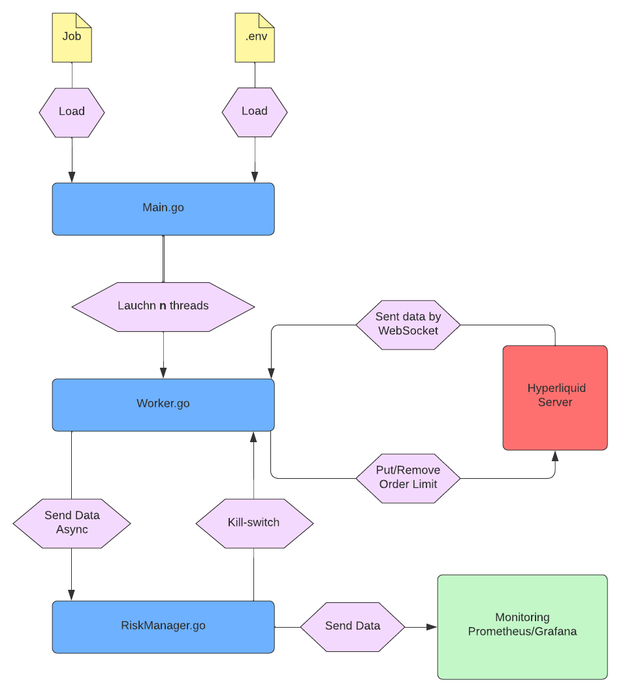

# High‑Frequency Market‑Making Bot on Hyperliquid

This README outlines the architecture and setup of a high-frequency market-making bot on Hyperliquid, a decentralized DeFi crypto exchange. The bot dynamically places limit orders to capture bid–ask spreads.

> **Note:** This repository currently hosts only the README. The full implementation is available upon request. If you're a recruiter or engineering team member and would like to review the code, please contact me via email or LinkedIn.

- 📧 thomas.gilger@gmail.com
- 🔗 [LinkedIn](https://www.linkedin.com/in/thomasgilger)

## 1. Technical Prerequisites
| Component     | Recommendation              | Justification                                                                 |
|---------------|-----------------------------|-------------------------------------------------------------------------------|
| **Language**  | Go >= 1.22                  | Low latency, high performance, and used by Hyperliquid                        |
| **Libraries** | `gorilla/websocket`         | Robust, low‑overhead WebSocket client                                         |
|               | `jsoniter`                  | Fast, zero‑allocation JSON parsing                                            |
|               | `prometheus/client_golang`  | Native metrics exposure for Prometheus                                        |
|               | `go.uber.org/zap`           | High-performance structured logging library |

## 2. Software Architecture

## 3. Deploying the Hyperliquid Node

1. **Server**
    - AWS (Tokyo) for low‑latency colocation
    - 4 vCPUs, 32 GB RAM, 200 GB NVMe SSD
2. **Installation**
    - Clone and run the official Hyperliquid node: https://github.com/hyperliquid-dex/node
    - Connect to it over WebSocket for real-time data and order actions
3. **Security**
    - Expose only the required ports (4001–4002) through the firewall
    - Protect the RPC endpoint with Nginx and mutual TLS (mTLS) for hardened access

## 4. Market‑Making Parameters

| Parameter               | Details                                                                                                                                                                                                           |
| ----------------------- |-------------------------------------------------------------------------------------------------------------------------------------------------------------------------------------------------------------------|
| **Dynamic Spread**      | Use `spread = spread_vol` when `spread_vol ≥ spread_min`. • `spread_vol` from RealizedVol, MedRV, EWMA (short-term). • `spread_min ≥ 0.03%` if 14-day volume ≥ \$500M. • Otherwise `spread_min ≥ 0.01%`. |
| **Trend Score**         | A normalized score in [−1, 1] based on short-term returns, RV, and microprice                                                                                                                                     |
| **One-Sided Orders**    | If `TrendScore ≥ 0`: post **bid only**. If `< 0`: post **ask only**.                                                                                                                   |
| **Order Size**          | ≤ `5%` of top-of-book depth on the quoted side.                                                                                                                                                                   |
| **Volatility Filter**   | Pause quoting if `spread_vol > 1%`.                                                                                                                                                                               |
| **Time-In-Force (TIF)** | ALO orders, 5 s expiry.                                                                                                                                                                                           |

## 5. Safeguards & Controls

| Limit | Automatic Action |
| --- | --- |
| **Max notional position** | Hedge with an opposite IOC (Immediate‑Or‑Cancel) order |
| **Intraday drawdown > X%** | Immediate shutdown (kill‑switch) |
| **WebSocket latency > 500 ms** | Trigger kill‑switch |
| **Message rate ≥ 1 900 msg/min** | Throttle via token‑bucket (safe < 2 000 msg/min) |
| **Orderbook divergence detected** | Re‑sync orderbook & cancel all pending orders |
| **Connection failure (node or bot)** | Automatic reconnection |

## 6. Operational Security

- **Structured, rotating logs** (using Zap)
- **Real‑time monitoring** (Prometheus & Grafana) for latency, P&L, inventory levels, and WebSocket queue depth
- **Secure API key storage** via a `.env` file (never commit secrets)

## 7. Future Enhancements

- **Advanced dynamic spread calculation**: implement a multi-tier volatility framework combining instantaneous (σ_fast), EWMA (σ_EWMA), range-based (σ_range) and micro-structural (σ_dur) estimators with a stress multiplier (M) and an Avellaneda-Stoikov-inspired half-spread formula for fully adaptive quoting
- **Machine-learning-driven quoting**: incorporate price prediction models and implement one-sided quoting strategies to further limit inventory exposure
