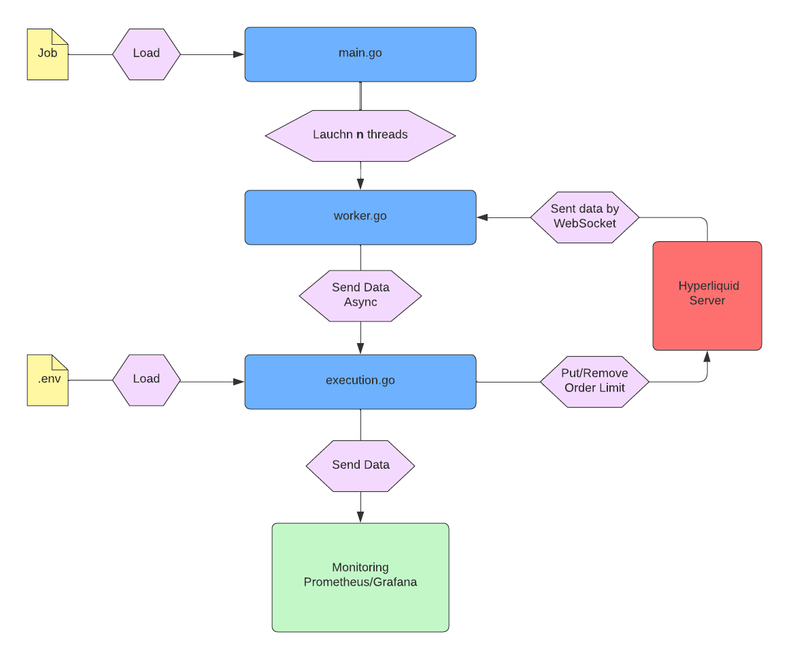

# High‑Frequency Market‑Making Bot on Hyperliquid

This README outlines the architecture and setup of a high-frequency market-making bot on Hyperliquid, a decentralized DeFi crypto exchange. The bot dynamically places limit orders to capture bid–ask spreads.

> **Note:** This repository currently hosts only the README. The full implementation is available upon request. If you're a recruiter or engineering team member and would like to review the code, please contact me via email or LinkedIn.

- 📧 thomas.gilger@gmail.com
- 🔗 [LinkedIn](https://www.linkedin.com/in/thomasgilger)

## 1. Technical Prerequisites
| Component     | Recommendation              | Justification                                                                 |
|---------------|-----------------------------|-------------------------------------------------------------------------------|
| **Language**  | Go >= 1.22                  | Low latency, high performance, and used by Hyperliquid                        |
| **Libraries** | `gorilla/websocket`         | Robust, low‑overhead WebSocket client                                         |
|               | `jsoniter`                  | Fast, zero‑allocation JSON parsing                                            |
|               | `prometheus/client_golang`  | Native metrics exposure for Prometheus                                        |
|               | `go.uber.org/zap`           | High-performance structured logging library |

## 2. Software Architecture

## 3. Deploying the Hyperliquid Node

1. **Server**
    - AWS (Tokyo) for low‑latency colocation
    - 4 vCPUs, 32 GB RAM, 200 GB NVMe SSD
2. **Installation**
    - Clone and run the official Hyperliquid node: https://github.com/hyperliquid-dex/node
    - Connect to it over WebSocket for real-time data and order actions
3. **Security**
    - Expose only the required ports (4001–4002) through the firewall
    - Protect the RPC endpoint with Nginx and mutual TLS (mTLS) for hardened access

## 4. Market‑Making Parameters

| Parameter | Details |
| --- | --- |
| **Dynamic Spread** | `spread = spread_vol` if `spread_vol ≥ spread_min` with: |
|  | • `spread_vol = f(RealizedVol + MedRV + EWMA)` |
|  | • `spread_min > 0.03%` when 14‑day volume ≥ 500 M (to cover fees) |
|  | • `spread_min > 0.01%` otherwise (reduced fees after certain volume) |
| **Order Size** | max `5%` of the order‑book depth on the quote side |
| **Volatility Filter** | • **Pause quoting** if `spread_vol` > 1% |
| **Time‑In‑Force (TIF)** | ALO (Add Liquidity Only) orders with a 5 s duration |

## 5. Safeguards & Controls

| Limit | Automatic Action |
| --- | --- |
| **Max notional position** | Hedge with an opposite IOC (Immediate‑Or‑Cancel) order |
| **Intraday drawdown > X%** | Immediate shutdown (kill‑switch) |
| **WebSocket latency > 500 ms** | Trigger kill‑switch |
| **Message rate ≥ 1 900 msg/min** | Throttle via token‑bucket (safe < 2 000 msg/min) |
| **Orderbook divergence detected** | Re‑sync orderbook & cancel all pending orders |
| **Connection failure (node or bot)** | Automatic reconnection |

## 6. Operational Security

- **Structured, rotating logs** (using Zap)
- **Real‑time monitoring** (Prometheus & Grafana) for latency, P&L, inventory levels, and WebSocket queue depth
- **Secure API key storage** via a `.env` file (never commit secrets)

## 7. Future Enhancements

- **Advanced dynamic spread calculation**: implement a multi-tier volatility framework combining instantaneous (σ_fast), EWMA (σ_EWMA), range-based (σ_range) and micro-structural (σ_dur) estimators with a stress multiplier (M) and an Avellaneda-Stoikov-inspired half-spread formula for fully adaptive quoting
- **Machine-learning-driven quoting**: incorporate price prediction models and implement one-sided quoting strategies to further limit inventory exposure
